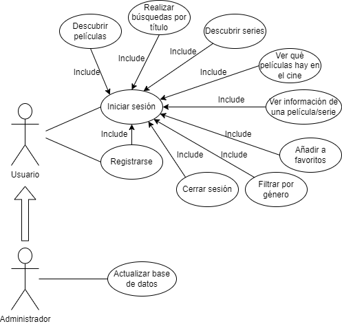

# Diseño funcional

**Diagrama de casos de uso:**

<figure><figcaption>
Diagrama de casos de uso
</figcaption></figure>

Como podemos ver en el diagrama de casos de uso, existen 2 tipos de usuarios en la aplicación, por un lado el usuario normal, el cual puede iniciar sesión si ya tiene una cuenta, o registrarse en la aplicación y luego iniciar sesión, además después podrá acceder a todas las funcionalidades de la aplicación. Por otro lado, el administrador, puede realizar todas las funciones del usuario además de poder actualizar la base de datos de películas y series.

\
**Modelo E/R:**

<figure><figcaption>
Modelo E/R
</figcaption></figure>

A pesar de que Firebase, la base de datos que utilizo, es NoSQL, la lógica que he utilizado es SQL y como vemos en el modelo entidad-relación, vienen representadas las tablas o, en este caso, colecciones, que van a guardar la información en la base de datos, las cuales son:

1. **Usuario:** Colección en la que se encuentran todos los usuarios que se han registrado en la aplicación. Guardamos el identificador#, nombre, email y contraseña.
2. **Favorito:** Colección en la que se encuentran las películas y series que guardan los usuarios en favoritos. Guardamos el identificador#, nombre, poster, resumen, géneros, identificador de la API, la fecha de estreno y el email del usuario.
3. **Comentario:** Colección en la que se encuentran todos los comentarios de los usuarios. Guardamos el identificador#, el texto que ha escrito el usuario, email del usuario y el identificador de la película o serie.
4. **Película/Serie:** Colección en la que se encuentran todas las películas y series que se han recogido de la API. Guardamos el identificador#, nombre, poster, resumen, géneros, identificador de la API y la fecha de estreno.
