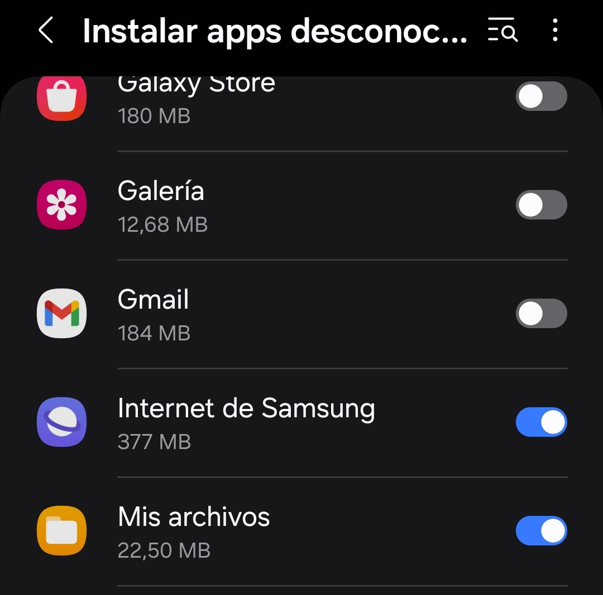

# Instalación y preparación

**Instalación:**

Para instalar la aplicación deberá seguir los siguientes pasos:&#x20;

1. Descargar la apk a través del repositorio de [GitHub](app/release/app-release.apk), donde se encuentra de manera pública.&#x20;
2. Una vez descargada, el usuario podrá realizar la instalación de forma manual en su dispositivo, pulsando sobre el apk desde la carpeta de descargar en la aplicación de archivos.&#x20;
3. Habilitar previamente los permisos para la instalación de aplicaciones desconocidas.&#x20;

<figure><figcaption><p>Habilitar permisos de instalación</p></figcaption></figure>

4. Una vez instalada, el usuario podrá utilizar la aplicación con total normalidad.

Además, al encontrarse el repositorio público, el usuario podrá clonar dicho proyecto y ejecutarlo directamente en su dispositivo y así poder tener la aplicación y ver el código.


**Preparación  del proyecto:**&#x20;

Para preparar el proyecto he añadido diversas dependencias para las distintas tecnologías o componentes que he utilizado:

* **Relay:**

```
// "build.gradle.kts(Module: app)"
// Relay 
    id("com.google.relay") version "0.3.10”
```

* **Firebase (Firestore):**

```
// "build.gradle.kts(Module: app)"
// Firestore
id("com.google.gms.google-services")
implementation(platform("com.google.firebase:firebase-bom:32.7.1"))
implementation("com.google.firebase:firebase-firestore-ktx:24.10.1")
// "build.gradle.kts(Project)"
id("com.google.gms.google-services") version "4.4.0" apply false
```

* **Firebase (Authentication):**

```
// "build.gradle.kts(Module: app)"
// Authentication
implementation("com.google.firebase:firebase-auth-ktx:22.3.1")
```

* **Retrofit:**&#x20;

```
// "build.gradle.kts(Module: app)"
// Retrofit
    implementation ("com.squareup.retrofit2:retrofit:2.9.0")
    implementation ("com.squareup.retrofit2:converter-gson:2.5.0")
```

* **Navigation:**

```
// "build.gradle.kts(Module: app)"
// Navigation
    implementation("androidx.navigation:navigation-compose:2.7.5")
```

Otros componentes utilizados:

* **AsyncImage:** Componente para mostrar una imagen a través de una URL.
* **YouTubePlayer:** Componente para mostrar un vídeo a través de un enlace de YouTube.
* **BottomSheetScaffold:** Componente para el diseño de la interfaz y la colocación del resto de componentes.

Dependencias utilizadas:

```
// "build.gradle.kts(Module: app)"
// AsyncImage
    implementation("io.coil-kt:coil-compose:2.5.0")
    
// YouTubePlayer
    implementation ("com.pierfrancescosoffritti.androidyoutubeplayer:core:12.1.0")
    
//BottomSheetScaffold
    implementation("androidx.compose.material:material:1.6.6")
```
